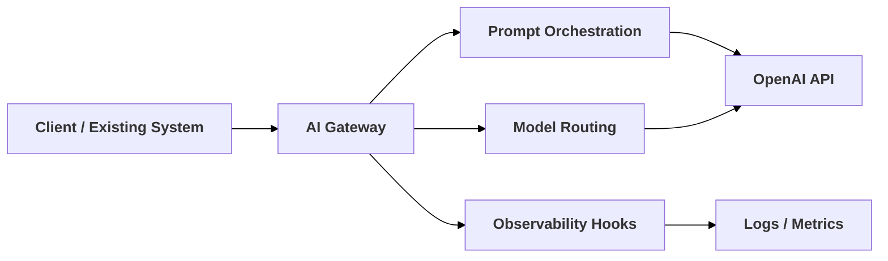
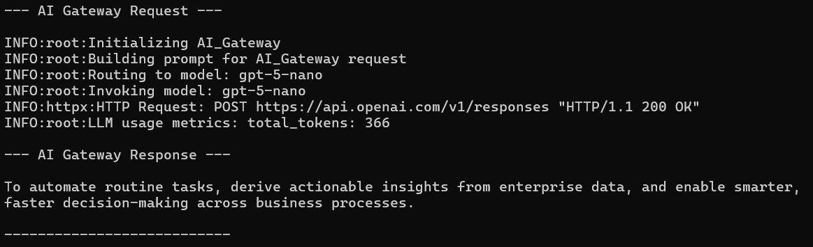
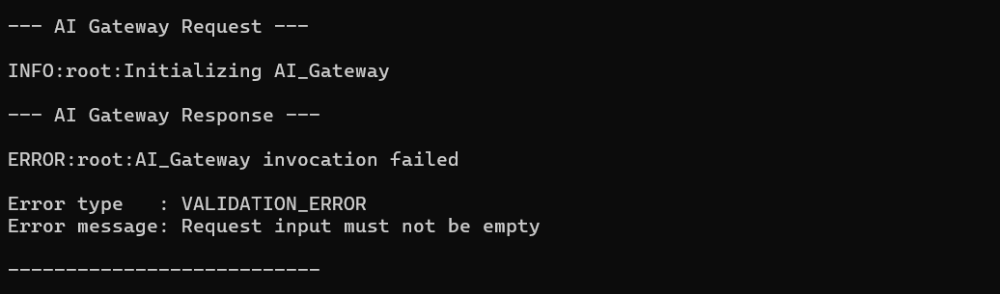

# AI Gateway - Enterprise LLM Integration Architecture


***Created by: [Suyog Hire - Solutions Architect](https://github.com/intarchs111)***

---

**AI Gateway** is a lightweight, runnable production-aligned **reference architecture** that introduces
Large Language Models into existing systems as a **centralized platform capability**.

This project focuses on **governance readiness, architectural boundaries, and operational clarity** rather than feature breadth, mirroring how AI enablement platforms are built inside organizations.


## ⚡ Quick Start  

[](https://github.com/intarchs111/ai-gateway)

```bash
git clone https://github.com/intarchs111/enterprise-ai-gateway.git
cd enterprise-ai-gateway
pip install -e .
echo "OPENAI_API_KEY=your_api_key_here" > .env
python examples/simple_invocation.py
```

## **Architecture Overview**


###

- Centralizes all OpenAI access behind a **single gateway**
- Separates **prompt orchestration, model routing, and observability**
- Keeps applications **vendor-agnostic and future-proof**
- Designed to reflect **real enterprise AI integration, and enablement patterns**
- **Platform first AI integration**, not an embedded application logic

### Runtime Output - AI-Gateway in Action

**1. Run Invocation**

Run `examples/simple_invocation.py` for a minimal, production-aligned gateway invocation. 

```bash
python examples/simple_invocation.py
```

This runs a single request through the AI Gateway, returning the application facing response.

**Result:**  




- Gateway initialization
- Model routing
- A single LLM response returned via the gateway boundary


**2. Run Failure Case**  

To see controlled failure handling:  
Run `examples/failure_path_invocation.py` 

```bash
python examples/failure_path_invocation.py
```


**Result:**  



- Input validation at the gateway
- Structured, provider-agnostic error handling

This output demonstrates the failure isolation, without application code calling LLM directly. 


### Releases

**📌 Release v1.0.0** : Initial AI Gateway reference implementation.  
See full [v1.0.0 Release Notes](../../releases/tag/v1.0) in GitHub Releases.


<div align="center">

##
<!-- Created by [Suyog Hire](https://github.com) -->
#### **Suyog Hire** - **Solutions Architect**
 [](https://github.com/intarchs111) [](https://linkedin.com/in/suyoghire)

</div>